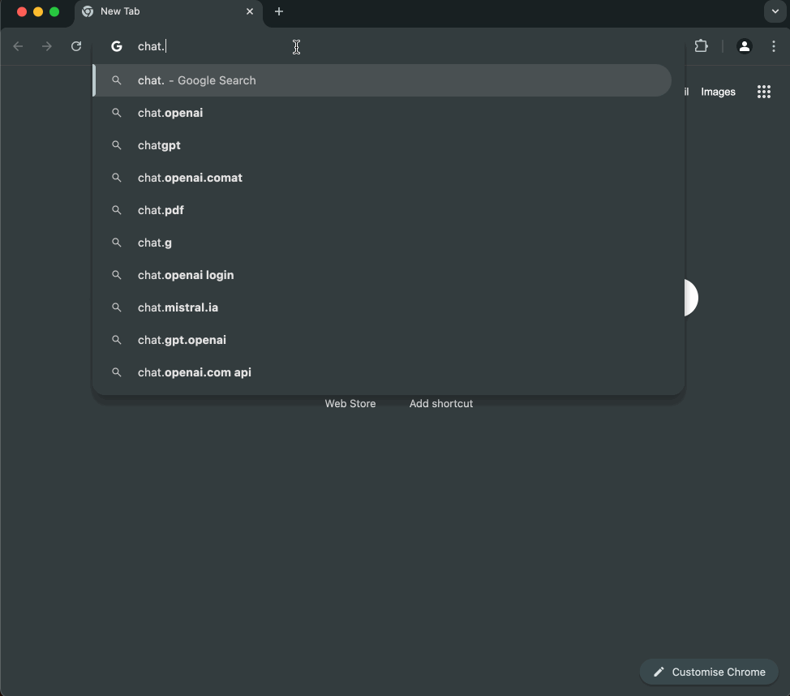
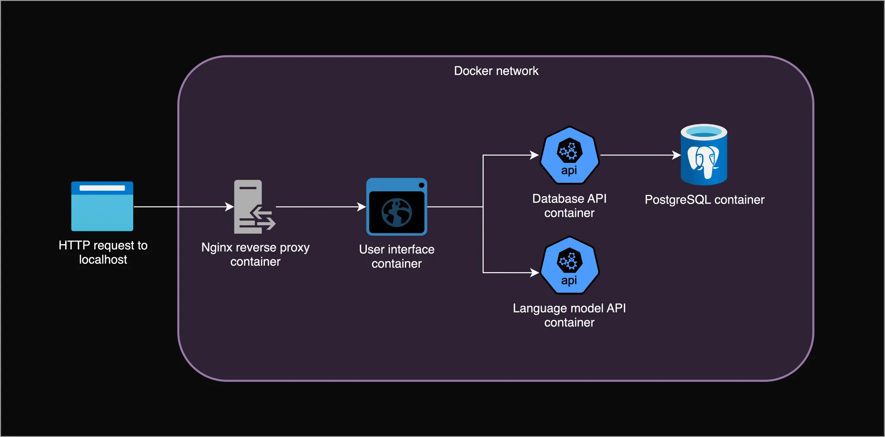
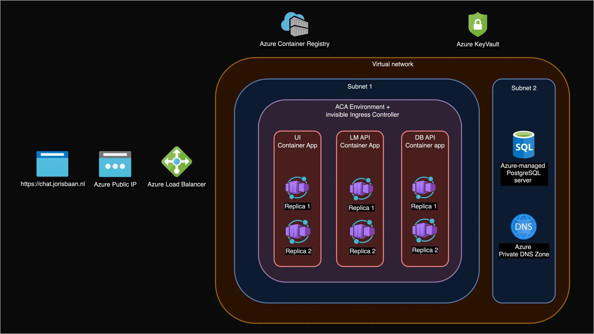

<a href="https://github.com/psf/black"></a>
# Design, Build & Deploy an AI Chat App from Scratch

The aim of this repository is to learn more about the fundamentals of modern, scalable web applications by designing, building and deploying an AI-powered chat app from scratch. We will have full control over the language model, data, infrastructure and costs. 

This will hopefully provide an glimpse of how real-world scalable AI systems work under the hood. The focus will be on engineering, backend and cloud deployment rather than the language model output or a fancy frontend. The app is built with FastAPI, PostgreSQL, llama.cpp, nginx, and Docker. 

There are two blogposts that accompany this repository. Please read them for a detailed walkthrough of the code.
1. add link
2. add link


Here is a quick demo of starting a new chat, coming back to that same chat, or starting another chat. This is the cloud deployment from part 2. It will be live at [chat.jorisbaan.nl](chat.jorisbaan.nl) until my Azure credits run out.




# Overview and directory structure
The local app is built with microservices. Each service has its own directory. They communicate over a private network through HTTP requests. For a detailed walkthrough, check the blogposts.


1. **Language model API**, CPU-based llama.cpp language model inference server with Alibaba Cloud's Qwen2.5-0.5B-Instruct model.
2. **Database,** a PostgreSQL database server that stores chats and messages.
3. **Database API**, a FastAPI+Uvicorn Python server that queries the PostgreSQL database.
4. **User interface**, a FastAPI+Uvicorn Python server that serves HTML and supports session-based authentication.
6. **Nginx** **reverse proxy**, a gateway between the outside world and network-isolated services.

# Running the app locally
To run the app with all its services locally, we use Docker Compose. Download Docker & Docker Compose, navigate to the root directory of this project, download the model into the lm-api/models directory, and start the app with Docker Compose:

```bash
cd $PROJECT_PATH
wget https://huggingface.co/Qwen/Qwen2.5-0.5B-Instruct-GGUF/resolve/main/qwen2.5-0.5b-instruct-q5_k_m.gguf -P lm-api/models
docker compose up --build
```
To run an individual service manually, look at the README.md in the `chat-ui`, `db-api`, `lm-api`, `nginx` and `db` directories.

# Deploying the app to Azure
To deploy the app to Microsoft Azure, create a (free) Azure account and install Docker. Then run the deploy_app.sh bash script. This installs the Azure CLI and creates all the infrastructure and resources we need to run our app on Azure.
```bash
cd $PROJECT_PATH
bash azure-deployment/deploy_app.sh
```
Here is a diagram of the cloud architecture.


# Requirements
To run the containerized app locally:
- Docker 26.6.1
- Docker compose 2.27.0

To run the database API and UI Python servers locally:
- Python 3.12.0
- packages in `chat-ui/requirements.txt` and `db-api/requirements.txt`

To deploy to Azure
- Azure account (free tier is enough), I'm using a [free education account](https://azure.microsoft.com/en-us/free/students). 
- Docker 26.6.1
- Azure CLI 2.28.0